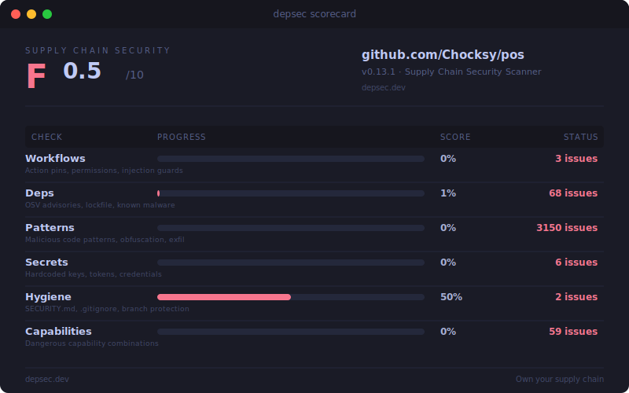

# DepSec

Supply chain security scanner for any project. Single binary, zero config.

Detects vulnerable dependencies, malicious code patterns, hardcoded secrets, workflow misconfigurations, and unexpected network connections — with AST-aware analysis, LLM triage, and reachability scoring.

[](https://github.com/chocksy/depsec/actions/workflows/ci.yml)
[](https://github.com/chocksy/depsec)
[](https://crates.io/crates/depsec)



## Benchmark

Tested against **10,582 real malware packages** from the [Datadog malicious-software-packages-dataset](https://github.com/DataDog/malicious-software-packages-dataset):

| Dataset | Packages | Detected | Rate |
|---------|----------|----------|------|
| npm malware | 8,806 | 8,806 | 100% |
| PyPI malware | 1,776 | 1,776 | 100% |
| **Total** | **10,582** | **10,582** | **100%** |

## Install

```sh
curl -fsSL https://raw.githubusercontent.com/chocksy/depsec/main/install.sh | sh
```

Or with Cargo:

```sh
cargo install depsec
```

## Quick Start

```sh
depsec scan .
```

```
depsec v0.8.0 — Supply Chain Security Scanner

Project: my-app
Grade: B (7.8/10)

[Patterns]
  ── ACTION REQUIRED (2 runtime packages) ──────
  evil-pkg (2 findings)
    ✗ P001: Shell Execution — exec() with variable input
      node_modules/evil-pkg/index.js:42
      → Verify commands are static or properly escaped
    ✗ P004: Credential Harvesting — reads ~/.ssh
      node_modules/evil-pkg/lib/steal.js:8
      → Remove immediately — no legitimate package reads your SSH keys

  ── BUILD TOOLS (safe, 12 findings collapsed) ──
  webpack, esbuild, vite — 12 findings in build-only tools

[Dependencies]
  ✓ 0 known vulnerabilities (142 packages checked via OSV)

[Secrets]
  ✓ No hardcoded secrets found (scanned 234 files)

[Workflows]
  ✓ All GitHub Actions pinned to SHA
  ✓ Workflow permissions minimized

[Hygiene]
  ✓ SECURITY.md exists
  ✓ .gitignore covers sensitive patterns

──────────────────────────
Rule Guide — what these rules mean:

P001: Shell Execution
  Calls child_process.exec/spawn with variable arguments.
  If user-controlled, enables Remote Code Execution.
  Common in build tools where it's expected.
```

## Features

### AST-Aware Analysis

Tree-sitter parses JS/TS into an AST for two-pass import-aware detection:

1. **Pass 1:** Find `require('child_process')` / `import` statements and track aliases
2. **Pass 2:** Flag exec/spawn calls only on those aliases

This means `regex.exec()` is not flagged, but `cp.exec(userInput)` is — eliminating the #1 source of false positives.

### Reachability Analysis

Parses your app's own source (not `node_modules`) to determine which dependencies are imported at runtime vs. build-only. Runtime findings get "ACTION REQUIRED" status; build-only findings are collapsed.

### Smart Secret Detection

Three-tier approach beyond regex:

| Rule | Method | Confidence |
|------|--------|------------|
| S001-S020 | 20 format-specific regexes (AWS, GitHub, Stripe, etc.) | Known patterns |
| S021 | AST variable name + high entropy + long value | High |
| S022 | AST variable name match (token, secret, password, etc.) | Medium |
| S023 | High entropy only (>4.5 bits/char, >30 chars) | Low |

Supports `// depsec:allow` inline comments to suppress individual lines.

### LLM Triage

Send findings to an LLM for classification (requires [OpenRouter](https://openrouter.ai) API key):

```sh
depsec scan . --triage              # Real triage via LLM
depsec scan . --triage-dry-run      # Preview what would be sent
```

Results are cached (30-day TTL) so repeat scans don't re-query.

### Persona Model

Control finding visibility by confidence level:

```sh
depsec scan . --persona regular     # High-confidence only (default)
depsec scan . --persona pedantic    # Medium+ confidence
depsec scan . --persona auditor     # All findings
depsec scan . --verbose             # Everything, no filtering
```

### Pre-commit Hook

Block commits containing hardcoded secrets:

```sh
depsec hook install     # Install git pre-commit hook
depsec hook uninstall   # Remove it
```

### Deep Package Audit

LLM-powered 4-phase analysis of a specific package:

```sh
depsec audit shelljs              # Deep audit
depsec audit shelljs --dry-run    # Preview capabilities
```

### Install Guard

Protected package installs with network monitoring:

```sh
depsec install-guard npm install lodash
```

Runs preflight checks, monitors network activity during install, and reports anomalies.

## Usage

### Scan

```sh
depsec scan .                         # All checks
depsec scan . --checks workflows,deps # Specific checks only
depsec scan . --json                  # JSON output
depsec scan . --format sarif          # SARIF output (for GitHub Code Scanning)
```

**Exit codes:** 0 = pass, 1 = findings, 2 = error.

### Auto-Fix

```sh
depsec fix .            # Pin GitHub Actions to commit SHAs
depsec fix . --dry-run  # Preview changes
```

### Network Monitor

```sh
depsec monitor npm test                  # Watch network during command
depsec monitor --learn npm install       # Record expected connections
depsec monitor --strict npm test         # Fail on unexpected connections
```

### Baseline

```sh
depsec baseline init    # Generate network baseline
depsec baseline check   # Compare CI run against baseline
```

### Other Commands

```sh
depsec preflight .          # Pre-install threat analysis (typosquatting, metadata)
depsec self-check           # Verify depsec's own integrity
depsec scorecard .          # Generate SVG scorecard image
depsec badge .              # Output badge markdown
depsec secrets-check        # Check for secrets (used by pre-commit hook)
depsec cache stats          # Show triage cache statistics
depsec cache clear          # Clear cached triage results
```

## Check Modules

### Patterns (10 pts)

Scans `node_modules/`, `vendor/`, `.venv/` for malicious code:

| Rule | What it catches | Severity |
|------|----------------|----------|
| P001 | Shell execution via child_process (AST-aware) | High |
| P002 | base64 decode → execute chains | Critical |
| P003 | HTTP calls to raw IP addresses | High |
| P004 | File reads targeting ~/.ssh, ~/.aws, ~/.env | Critical |
| P005 | Binary file read → byte extraction → execution | Critical |
| P006 | postinstall scripts with network calls | High |
| P007 | High-entropy encoded payloads (>200 chars) | Medium |
| P008 | `new Function()` with dynamic input (AST-aware) | High |
| P009 | Python .pth file with executable code | Critical |
| P010 | Cloud IMDS credential probing (169.254.169.254) | Critical |
| P011 | Environment variable serialization/exfiltration | High |
| P012 | Suspicious install hooks in package.json | High |

### Dependencies (20 pts)

Queries [OSV](https://osv.dev) for known vulnerabilities across all ecosystems:

| Lockfile | Ecosystem |
|----------|-----------|
| `Cargo.lock` | Rust |
| `package-lock.json` / `yarn.lock` / `pnpm-lock.yaml` | Node |
| `Gemfile.lock` | Ruby |
| `go.sum` | Go |
| `poetry.lock` / `Pipfile.lock` / `requirements.txt` | Python |

### Secrets (25 pts)

20 format-specific regex patterns plus AST-based detection:

AWS keys, GitHub tokens (classic/fine-grained/app), private keys, JWTs, Slack webhooks/tokens, Stripe keys, SendGrid keys, Google API keys, NPM tokens, database connection strings (Postgres/MySQL/MongoDB), Heroku API keys, Twilio keys, and entropy-based detection for unknown formats.

### Workflows (25 pts)

| Rule | What it catches | Severity |
|------|----------------|----------|
| W001 | Actions not pinned to commit SHA | High |
| W002 | Missing or write-all permissions | Medium |
| W003 | `pull_request_target` with checkout | Critical |
| W004 | User-controlled expressions in `run:` blocks | Critical |
| W005 | `--no-verify` or `--force` in git commands | Medium |

### Repo Hygiene (10 pts)

| Rule | What it checks |
|------|---------------|
| H001 | `SECURITY.md` exists |
| H002 | `.gitignore` covers `.env`, `*.pem`, `*.key` |
| H003 | Lockfile committed (not gitignored) |
| H004 | Branch protection on main (requires `GITHUB_TOKEN`) |

## Configuration

Create `depsec.toml` in your project root:

```toml
[ignore]
patterns = ["DEPSEC-P003"]              # Suppress rules by ID
secrets = ["tests/fixtures/*"]           # Ignore paths for secrets scan
hosts = ["internal-mirror.company.com"]  # Baseline allowed hosts

[patterns]
skip_dirs = ["legacy-vendor"]            # Extra dirs to skip in pattern scan

[patterns.allow]
shelljs = ["DEPSEC-P001"]               # Allow P001 for shelljs specifically

[checks]
enabled = ["workflows", "deps", "patterns", "secrets", "hygiene"]

[scoring]
workflows = 25
deps = 20
patterns = 10
secrets = 25
hygiene = 10
network = 10

[triage]
api_key_env = "OPENROUTER_API_KEY"       # Env var containing API key
model = "anthropic/claude-sonnet-4-6"      # LLM model for triage
max_findings = 20                         # Max findings to triage per run
timeout_seconds = 60
cache_ttl_days = 30
```

## Scoring

| Score | Grade |
|-------|-------|
| 90-100 | A |
| 75-89 | B |
| 60-74 | C |
| 40-59 | D |
| 0-39 | F |

## Comparison

| Feature | depsec | gitleaks | TruffleHog | GuardDog |
|---------|--------|----------|------------|----------|
| Secrets (regex) | 20 patterns | 800+ patterns | 800+ detectors | - |
| Secrets (AST+entropy) | Yes | - | - | - |
| Malware detection | 12 pattern rules | - | - | Yes |
| AST-aware analysis | tree-sitter | - | - | semgrep |
| Vulnerability scan | OSV (all ecosystems) | - | - | - |
| Workflow security | 5 rules | - | - | - |
| Network monitoring | Yes | - | - | - |
| LLM triage | OpenRouter | - | - | - |
| Reachability | Import analysis | - | - | - |
| Single binary | Yes | Yes | Yes | No (Python) |
| Zero config | Yes | Yes | Yes | Yes |

## Design Principles

1. **Own the parsers** — no shelling out to `npm audit` or `cargo audit`
2. **Query OSV directly** — single API for all ecosystems
3. **AST over regex** — tree-sitter eliminates false positives
4. **No plugins** — closed attack surface
5. **No secrets required** — pure read-only analysis (tokens optional)
6. **14 direct dependencies** — minimal supply chain surface

## License

MIT
