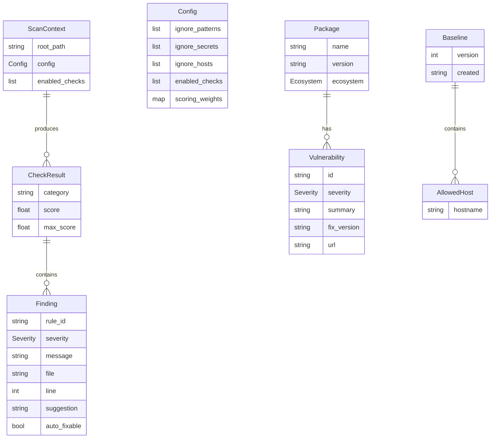

# DepSec MVP Implementation Plan

## Overview

Build DepSec — a Rust CLI supply chain security scanner that detects vulnerable dependencies, malicious code patterns, hardcoded secrets, workflow misconfigurations, and unexpected CI network connections. Ships as a single static binary + GitHub Action.

**Repo:** `chocksy/depsec`
**Language:** Rust (single static binary, 8 direct dependencies)
**Design Spec:** `docs/specs/2026-03-27-depsec-design.md`

## Problem Statement

Modern supply chain attacks (Telnyx, event-stream, ua-parser-js) exploit trust in dependencies. Existing tools are fragmented — `cargo audit` only covers Rust, `npm audit` only Node, and none scan dependency source code for malicious patterns. DepSec provides a single binary that audits any project across all ecosystems with zero configuration.

## Proposed Solution

A module-by-module implementation building each check independently with full tests before moving to the next. Eight phases from CLI foundation to distribution.

## Technical Approach

### Architecture

```
                    ┌─────────────┐
                    │   main.rs   │  CLI entry (clap)
                    │  (clap CLI) │
                    └──────┬──────┘
                           │
                    ┌──────▼──────┐
                    │ scanner.rs  │  Orchestrator — runs checks, collects results
                    └──────┬──────┘
                           │
          ┌────────────────┼────────────────┐
          │                │                │
   ┌──────▼──────┐ ┌──────▼──────┐ ┌───────▼──────┐
   │  config.rs  │ │  output.rs  │ │  fixer.rs    │
   │  (depsec.   │ │  (scorecard │ │  (auto-fix   │
   │   toml)     │ │  + JSON)    │ │   engine)    │
   └─────────────┘ └─────────────┘ └──────────────┘

   ┌─────────────────── checks/ ──────────────────┐
   │ workflows.rs │ deps.rs │ patterns.rs │        │
   │ secrets.rs   │ hygiene.rs                     │
   └──────────────────────┬───────────────────────┘
                          │
   ┌──────────── parsers/ ─┴───────────────────────┐
   │ cargo_lock.rs │ package_lock.rs │              │
   │ gemfile_lock.rs │ go_sum.rs │ pip.rs           │
   └───────────────────────────────────────────────┘

   ┌─────────────────── action/ ──────────────────┐
   │ action.yml │ entrypoint.sh │ post.sh          │
   │ (GitHub Action — wraps CLI + tcpdump)         │
   └──────────────────────────────────────────────┘
```

### Key Design Decisions

1. **Own all parsers** — no shelling out to `cargo audit`, `npm audit`, etc.
2. **Query OSV directly** — single API (`api.osv.dev`) for all ecosystems via batch endpoint (`/v1/querybatch`)
3. **Own secret patterns** — 20-30 high-confidence regexes, no scanning libraries
4. **Static-first** — static analysis catches 95% of attacks. Network monitor is a CI bonus layer
5. **No plugins** — closed attack surface, every detection rule is in-repo
6. **Blocking reqwest** — no async runtime needed, simpler architecture
7. **Two-phase CI scan** — pre-step runs static checks (workflows, secrets, hygiene); post-step runs pattern scanner (after deps installed) + network baseline diff

### Error Handling Strategy

- `anyhow` for the binary (main.rs, scanner.rs) — ergonomic error propagation with context
- `thiserror` for library-level errors (checks/, parsers/) — typed errors for programmatic handling
- These are additions beyond the spec's 8 crates but are idiomatic Rust for CLI tools

### Design Decisions from Spec Gaps

| Gap | Decision |
|-----|----------|
| Pattern scanner vs .gitignore | Pattern scanner ignores .gitignore — it scans dependency dirs (node_modules, vendor, etc.) directly. Secrets scanner respects .gitignore. |
| Scoring for N/A categories | Full points — no violations = perfect score for that category |
| Multi-lockfile same ecosystem | Parse ALL lockfiles found, deduplicate packages by name+version before OSV query |
| Monorepo support | Recurse subdirectories to find lockfiles (max depth configurable in depsec.toml, default 3) |
| OSV API failure | Exit code 2 (error). No partial results — fail fast for security tools |
| `depsec fix --dry-run` | Include from the start. Security tool modifying CI files needs preview mode |
| `baseline init` locally | Creates template with common registry hosts pre-populated. Manual editing for customization |
| GitHub Action timing | Two-phase: pre-step runs static checks, post-step runs pattern scan + network diff |
| `requirements.txt` unpinned | Skip entries without exact pins (`==`), warn user. Only `poetry.lock` and `Pipfile.lock` are reliable for Python |
| Intra-category scoring | Equal weight per check within category. Severity multiplier: critical=3x, high=2x, medium=1x, low=0.5x deduction |
| Injection expressions | Broad set: all `github.event.*` user-controlled fields (issue.body, pr.title, pr.body, comment.body, review.body, head_commit.message, pages.*.page_name) |
| Action mode values | `full` (static + network), `static` (static only, default), `report` (post-install pattern scan + network) |

## Implementation Phases

### Phase 1: Foundation — CLI Skeleton + Config + Output + Scoring

**Goal:** Working `depsec` binary that parses CLI args, loads config, and produces formatted (empty) output.

**Files to create:**

```
Cargo.toml
.gitignore
src/
  main.rs           — clap CLI with scan/fix/baseline/badge subcommands
  scanner.rs         — orchestrator: runs checks, collects CheckResult structs
  config.rs          — depsec.toml parsing with serde + toml
  output.rs          — scorecard renderer (human-readable + JSON)
  scoring.rs         — score calculation, grade assignment, weight normalization
  checks/
    mod.rs           — CheckResult trait, Finding struct, Severity enum
```

**Key types:**

```rust
// checks/mod.rs
pub enum Severity { Critical, High, Medium, Low }

pub struct Finding {
    pub rule_id: String,        // e.g., "DEPSEC-W001"
    pub severity: Severity,
    pub message: String,
    pub file: Option<String>,
    pub line: Option<usize>,
    pub suggestion: Option<String>,
    pub auto_fixable: bool,
}

pub struct CheckResult {
    pub category: String,       // "workflows", "deps", etc.
    pub findings: Vec<Finding>,
    pub score: f64,             // 0.0 to max_weight
    pub max_score: f64,         // from config weights
}

pub trait Check {
    fn name(&self) -> &str;
    fn run(&self, ctx: &ScanContext) -> anyhow::Result<CheckResult>;
}
```

**Acceptance Criteria:**

- [ ] `cargo build` compiles with all 8 dependencies + anyhow + thiserror
- [ ] `depsec scan .` prints empty scorecard with Grade A (100/100, no checks implemented yet)
- [ ] `depsec scan . --json` outputs valid JSON
- [ ] `depsec scan . --checks workflows` accepts filter flag
- [ ] `depsec.toml` is loaded if present, defaults used if absent
- [ ] `--no-color` and `NO_COLOR` env var suppress ANSI codes
- [ ] Exit codes: 0 (pass), 1 (findings), 2 (error) wired up
- [ ] Unit tests for config parsing, scoring calculation, output formatting

---

### Phase 2: Workflows Check Module + Auto-Fix

**Goal:** Detect GitHub Actions misconfigurations and auto-fix SHA pinning.

**Files to create:**

```
src/checks/workflows.rs    — all workflow checks
src/fixer.rs               — auto-fix engine (SHA pinning via GitHub API)
tests/fixtures/workflows/  — test workflow YAML files
```

**Checks implemented:**

| Rule ID | Check | Severity |
|---------|-------|----------|
| DEPSEC-W001 | Actions not pinned to commit SHA | High |
| DEPSEC-W002 | `permissions` block missing or `write-all` | Medium |
| DEPSEC-W003 | `pull_request_target` with `actions/checkout` | Critical |
| DEPSEC-W004 | User-controlled `${{ github.event.* }}` in `run:` blocks | Critical |
| DEPSEC-W005 | `--no-verify` or `--force` in git commands | Medium |

**Injection expression allow-list** (DEPSEC-W004):

```
github.event.issue.body
github.event.issue.title
github.event.pull_request.title
github.event.pull_request.body
github.event.comment.body
github.event.review.body
github.event.review_comment.body
github.event.head_commit.message
github.event.head_commit.author.name
github.event.pages.*.page_name
github.event.commits.*.message
github.event.discussion.body
github.event.discussion.title
```

**Auto-fix (`depsec fix`):**

- Reads workflow YAML files
- Finds `uses: owner/repo@tag` entries (not already SHA-pinned)
- Resolves tag → commit SHA via GitHub API (`GET /repos/{owner}/{repo}/git/ref/tags/{tag}`)
- Rewrites with comment: `uses: owner/repo@<sha> # <original-tag>`
- `--dry-run` prints changes without writing
- Handles: local actions (`./`), Docker actions (`docker://`), reusable workflows — skips these, only pins marketplace actions
- Rate limiting: respects GitHub API limits, uses token from `GITHUB_TOKEN` env var if available (unauthenticated: 60/hr, authenticated: 5000/hr)

**Acceptance Criteria:**

- [ ] `depsec scan .` on a repo with GitHub Actions reports workflow findings
- [ ] All 5 rule IDs detected with correct severity
- [ ] `depsec fix .` rewrites workflow files with SHA pins + tag comments
- [ ] `depsec fix . --dry-run` shows changes without modifying files
- [ ] Skips local actions, Docker actions, reusable workflows
- [ ] Works without `GITHUB_TOKEN` (unauthenticated API, warns about rate limits)
- [ ] Fixture tests for each rule ID with passing and failing examples
- [ ] Test: workflow with no issues → 25/25 Workflows score
- [ ] Test: directory with no `.github/workflows/` → 25/25 (N/A = full points)

---

### Phase 3: Secrets Detection Module

**Goal:** Regex-based scanning of committed files for hardcoded secrets.

**Files to create:**

```
src/checks/secrets.rs       — secret pattern matching
tests/fixtures/secrets/     — test files with fake secrets
```

**Pattern set (20+ high-confidence patterns):**

| Rule ID | Secret Type | Pattern |
|---------|-------------|---------|
| DEPSEC-S001 | AWS Access Key | `AKIA[0-9A-Z]{16}` |
| DEPSEC-S002 | AWS Secret Key | `(?i)aws_secret_access_key\s*[:=]\s*['"]?[A-Za-z0-9/+=]{40}` |
| DEPSEC-S003 | GitHub Token (classic) | `ghp_[A-Za-z0-9_]{36,}` |
| DEPSEC-S004 | GitHub Token (fine-grained) | `github_pat_[A-Za-z0-9_]{22,}` |
| DEPSEC-S005 | GitHub App Token | `ghs_[A-Za-z0-9_]{36,}` |
| DEPSEC-S006 | Private Key (RSA/EC/DSA) | `-----BEGIN (RSA\|EC\|DSA )?PRIVATE KEY-----` |
| DEPSEC-S007 | JWT Token | `eyJ[A-Za-z0-9\-_]+\.eyJ[A-Za-z0-9\-_]+\.[A-Za-z0-9\-_.+/=]+` |
| DEPSEC-S008 | Slack Webhook | `hooks\.slack\.com/services/T[A-Z0-9]+/B[A-Z0-9]+/` |
| DEPSEC-S009 | Slack Bot Token | `xoxb-[0-9]{10,}-[A-Za-z0-9]+` |
| DEPSEC-S010 | Generic API Key | `(?i)(api[_\-]?key\|api[_\-]?secret)\s*[:=]\s*['"][A-Za-z0-9]{20,}['"]` |
| DEPSEC-S011 | Generic Secret | `(?i)(secret[_\-]?key\|client[_\-]?secret)\s*[:=]\s*['"][A-Za-z0-9]{20,}['"]` |
| DEPSEC-S012 | Connection String (Postgres) | `postgres(ql)?://[^\s'"]+:[^\s'"]+@[^\s'"]+` |
| DEPSEC-S013 | Connection String (MySQL) | `mysql://[^\s'"]+:[^\s'"]+@[^\s'"]+` |
| DEPSEC-S014 | Connection String (MongoDB) | `mongodb(\+srv)?://[^\s'"]+:[^\s'"]+@[^\s'"]+` |
| DEPSEC-S015 | Stripe Key | `(sk\|pk)_(live\|test)_[A-Za-z0-9]{20,}` |
| DEPSEC-S016 | SendGrid Key | `SG\.[A-Za-z0-9\-_]{22,}\.[A-Za-z0-9\-_]{22,}` |
| DEPSEC-S017 | Twilio Key | `SK[0-9a-fA-F]{32}` |
| DEPSEC-S018 | Google API Key | `AIza[0-9A-Za-z\-_]{35}` |
| DEPSEC-S019 | Heroku API Key | `(?i)heroku.*[0-9a-f]{8}-[0-9a-f]{4}-[0-9a-f]{4}-[0-9a-f]{4}-[0-9a-f]{12}` |
| DEPSEC-S020 | NPM Token | `npm_[A-Za-z0-9]{36}` |

**File selection:**

- Uses `git ls-files` to get tracked files (avoids scanning node_modules, .git, etc.)
- Falls back to walkdir + .gitignore matching if not in a git repo
- Skips binary files (check for null bytes in first 8KB)
- Respects `[ignore] secrets = ["tests/fixtures/*"]` from depsec.toml
- Skips files > 1MB (configurable)

**Acceptance Criteria:**

- [ ] Detects all 20 secret patterns with correct rule IDs
- [ ] Only scans git-tracked files (not node_modules, not .git)
- [ ] Respects depsec.toml ignore paths
- [ ] Skips binary files
- [ ] Reports file path + line number + masked secret (shows first/last 4 chars)
- [ ] No false positives on test fixture files when properly ignored
- [ ] Test: clean repo → 25/25 Secrets score
- [ ] Test: repo with AWS key → finding with correct severity + suggestion
- [ ] Performance: scans 1000 files in < 2 seconds

---

### Phase 4: Dependency Auditing — Lockfile Parsers + OSV Integration

**Goal:** Parse lockfiles from 5 ecosystems and query OSV for known vulnerabilities.

**Files to create:**

```
src/checks/deps.rs          — orchestrator: detect lockfiles, parse, query OSV
src/parsers/
  mod.rs                    — Package struct, Parser trait
  cargo_lock.rs             — Cargo.lock parser (v1 + v2/v3 format)
  package_lock.rs           — package-lock.json (v1/v2/v3), yarn.lock (v1), pnpm-lock.yaml
  gemfile_lock.rs           — Gemfile.lock parser
  go_sum.rs                 — go.sum parser (deduplicate by module name)
  pip.rs                    — poetry.lock, Pipfile.lock, requirements.txt (pinned only)
tests/fixtures/lockfiles/   — sample lockfiles for each format
```

**Package struct:**

```rust
// parsers/mod.rs
pub struct Package {
    pub name: String,
    pub version: String,
    pub ecosystem: Ecosystem,  // Crates, Npm, RubyGems, Go, PyPI
}

pub enum Ecosystem {
    CratesIo,   // OSV: "crates.io"
    Npm,         // OSV: "npm"
    RubyGems,    // OSV: "RubyGems"
    Go,          // OSV: "Go"
    PyPI,        // OSV: "PyPI"
}
```

**Lockfile detection:**

- Recurse from scan root up to `max_depth` (default 3, configurable)
- When multiple lockfiles exist for the same ecosystem in the same dir, parse all and deduplicate
- `requirements.txt`: only include entries with `==` pinning, warn about unpinned entries

**OSV API integration:**

- Batch endpoint: `POST https://api.osv.dev/v1/querybatch`
- Batch size: 1000 packages per request (OSV limit)
- Timeout: 30 seconds per request
- Retry: 1 retry with exponential backoff on 5xx
- On failure (network error, timeout): exit code 2 — no partial results
- Map ecosystem enum to OSV ecosystem string

**Vulnerability reporting:**

```
[Dependencies]
  ✓ Lockfile committed (Cargo.lock)
  ✗ 3 known vulnerabilities found (142 packages checked via OSV)
    CRITICAL: serde 1.0.100 — RUSTSEC-2024-0001 (deserialization RCE)
      → Upgrade to serde >= 1.0.171
    HIGH: openssl 0.10.35 — RUSTSEC-2023-0072 (buffer overflow)
      → Upgrade to openssl >= 0.10.60
    LOW: regex 1.5.4 — RUSTSEC-2022-0013 (ReDoS)
      → Upgrade to regex >= 1.5.5
```

**Acceptance Criteria:**

- [ ] Detects lockfiles for all 5 ecosystems
- [ ] Parses Cargo.lock v1/v2/v3 formats correctly
- [ ] Parses package-lock.json v1/v2/v3
- [ ] Parses yarn.lock v1 format
- [ ] Parses pnpm-lock.yaml
- [ ] Parses Gemfile.lock
- [ ] Parses go.sum (deduplicates multiple versions)
- [ ] Parses poetry.lock and Pipfile.lock
- [ ] Handles requirements.txt (pinned-only, warns on unpinned)
- [ ] Queries OSV batch API correctly with proper ecosystem mapping
- [ ] Reports vulnerability severity + advisory ID + fix suggestion
- [ ] Handles OSV API timeout/failure with exit code 2
- [ ] Checks lockfile is committed (not in .gitignore)
- [ ] Monorepo: finds lockfiles in subdirectories up to configured depth
- [ ] Multi-lockfile: deduplicates packages before querying OSV
- [ ] Unit tests for each parser with real-world lockfile fixtures
- [ ] Integration test with mock OSV responses

---

### Phase 5: Suspicious Pattern Scanner

**Goal:** Scan dependency source files for malicious code patterns.

**Files to create:**

```
src/checks/patterns.rs      — pattern scanning engine
tests/fixtures/patterns/    — test files with suspicious and benign code
```

**Scan targets (per ecosystem):**

| Ecosystem | Directories to scan |
|-----------|-------------------|
| Node | `node_modules/` |
| Ruby | `vendor/bundle/`, `vendor/gems/` |
| Python | `.venv/`, `venv/`, `site-packages/` (within virtualenvs) |
| Go | `vendor/` (only if Go vendor mode is used) |
| Rust | N/A (Rust deps compile from source, not vendored at rest) |

**Pattern rules:**

| Rule ID | Pattern | What it catches | Severity |
|---------|---------|----------------|----------|
| DEPSEC-P001 | `eval()` / `exec()` with decoded/variable input | Classic obfuscation | High |
| DEPSEC-P002 | base64 decode → execute chain | Encoded payload execution | Critical |
| DEPSEC-P003 | HTTP/HTTPS to raw IP addresses (not localhost) | C2 server communication | High |
| DEPSEC-P004 | File reads targeting `~/.ssh`, `~/.aws`, `~/.env`, `~/.gnupg` | Credential theft | Critical |
| DEPSEC-P005 | Binary read → byte extraction → execution | Steganography (Telnyx WAV) | Critical |
| DEPSEC-P006 | `postinstall`/`preinstall` scripts with network calls or binary downloads | Install-time payloads | High |
| DEPSEC-P007 | High-entropy strings (>200 chars, entropy > 4.5 bits/char) | Encoded payloads | Medium |
| DEPSEC-P008 | `new Function(...)` with dynamic input | Dynamic code execution | High |

**Performance guardrails:**

- Skip files > 500KB (catches minified JS bundles that would false-positive)
- Skip known binary extensions (`.node`, `.so`, `.dll`, `.wasm`, `.exe`, `.png`, `.jpg`, etc.)
- Max 100,000 files per scan (configurable) — warn and skip if exceeded
- DEPSEC-P007 (entropy): skip files with `.min.js` extension and files in known asset dirs

**CI timing consideration:**

In the GitHub Action, the pattern scanner runs in the **post-step** (after `npm install` etc.), not the pre-step. This ensures dependency directories exist.

For local CLI use, dependency directories are expected to exist already (developer has run `npm install`, `bundle install`, etc.).

**Acceptance Criteria:**

- [ ] Detects all 8 rule patterns with correct severity
- [ ] Scans correct directories per ecosystem
- [ ] Does NOT respect .gitignore (intentionally scans node_modules etc.)
- [ ] Skips files > 500KB
- [ ] Skips binary files
- [ ] Entropy calculation (Shannon entropy) is correct
- [ ] Skips `.min.js` files for DEPSEC-P007
- [ ] Reports file path + line number + rule ID + matched snippet (truncated)
- [ ] Respects `[ignore] patterns = ["DEPSEC-P003"]` from depsec.toml
- [ ] Fixture tests: one malicious file and one benign file per rule
- [ ] Performance: scans 10,000 files in < 10 seconds

---

### Phase 6: Repo Hygiene Module

**Goal:** Check repository configuration best practices.

**Files to create:**

```
src/checks/hygiene.rs       — repo hygiene checks
tests/fixtures/hygiene/     — test repo structures
```

**Checks:**

| Rule ID | Check | Severity |
|---------|-------|----------|
| DEPSEC-H001 | `SECURITY.md` exists in repo root | Medium |
| DEPSEC-H002 | `.gitignore` covers sensitive patterns | Low |
| DEPSEC-H003 | Lockfile committed (not gitignored) | High |
| DEPSEC-H004 | Branch protection on main (requires `GITHUB_TOKEN`) | Medium |

**DEPSEC-H002 — .gitignore sensitive patterns:**

Ecosystem-aware checking. Only require patterns relevant to the detected ecosystem:

| Pattern | Required when |
|---------|--------------|
| `.env` | Always |
| `*.pem` | Always |
| `*.key` | Always |
| `credentials.json` | Python/Node projects |
| `.env.local` | Node projects |
| `*.p12` | Always |

**DEPSEC-H004 — Branch protection:**

- Only runs when `GITHUB_TOKEN` env var is set
- Parses git remote URL to extract owner/repo
- Calls `GET /repos/{owner}/{repo}/branches/main/protection`
- If no token: skip check, don't deduct points (N/A)
- If API returns 404: branch protection not enabled → finding

**Acceptance Criteria:**

- [ ] Detects missing SECURITY.md
- [ ] Detects missing .gitignore patterns (ecosystem-aware)
- [ ] Detects uncomitted/gitignored lockfiles
- [ ] Checks branch protection when GITHUB_TOKEN available
- [ ] Gracefully skips branch protection check without token (no point deduction)
- [ ] Fixture tests for each check
- [ ] Test: perfect repo → 10/10 Hygiene score

---

### Phase 7: Network Monitor + Baseline + GitHub Action

**Goal:** CI network monitoring via tcpdump + baseline comparison. GitHub Action packaging.

**Files to create:**

```
src/baseline.rs             — baseline file management (init, check, diff)
action.yml                  — GitHub Action definition (composite action)
action/
  entrypoint.sh             — pre-step: static scan + start tcpdump
  post.sh                   — post-step: pattern scan + stop tcpdump + baseline diff
tests/fixtures/baselines/  — test baseline files
```

**`depsec baseline init`:**

- Creates `depsec.baseline.json` with common registry hosts pre-populated per detected ecosystem:
  - Always: `github.com`, `api.github.com`
  - Rust: `crates.io`, `static.crates.io`
  - Node: `registry.npmjs.org`
  - Ruby: `rubygems.org`, `index.rubygems.org`
  - Go: `proxy.golang.org`, `sum.golang.org`
  - Python: `pypi.org`, `files.pythonhosted.org`
  - Always: `api.osv.dev` (depsec itself)
- User edits to add custom hosts

**`depsec baseline check`:**

- Reads captured connections file (tcpdump parsed output)
- Reads baseline file
- Reverse DNS lookup on captured IPs (with 2s timeout per lookup)
- IPs without PTR records: report raw IP, flag as unknown
- Diff: report new hosts not in baseline as findings

**GitHub Action (`action.yml`) — composite action:**

```yaml
inputs:
  mode:
    description: 'Scan mode: static (default), full (static + network), report (post-install pattern scan + network)'
    default: 'static'
  baseline:
    description: 'Path to baseline file, or "auto" to generate on first run'
    default: ''
  fail-on:
    description: 'Minimum severity to fail the job: critical, high, medium, low, any'
    default: 'any'
  github-token:
    description: 'GitHub token for branch protection check and SHA resolution'
    default: '${{ github.token }}'

outputs:
  score:
    description: 'Numerical score (0-100)'
  grade:
    description: 'Letter grade (A-F)'
  findings-count:
    description: 'Total number of findings'
```

**Two-phase CI flow:**

1. **Pre-step** (`entrypoint.sh`):
   - Install depsec binary (from release)
   - Run `depsec scan . --checks workflows,secrets,hygiene --json > /tmp/depsec-pre.json`
   - If `mode=full`: start `tcpdump -i any -nn -q > /tmp/depsec-capture.pcap &`

2. **User's steps run normally** (npm install, build, test, etc.)

3. **Post-step** (`post.sh`):
   - If `mode=full` or `mode=report`:
     - Run `depsec scan . --checks deps,patterns --json > /tmp/depsec-post.json`
     - Stop tcpdump
     - Run `depsec baseline check --capture /tmp/depsec-capture.pcap`
   - Merge pre + post results
   - Evaluate against `fail-on` threshold
   - Set outputs (score, grade, findings-count)

**tcpdump fallback:**

- If `tcpdump` not available (no sudo): warn and skip network monitoring
- Degrade gracefully — static checks still run

**Acceptance Criteria:**

- [ ] `depsec baseline init` creates pre-populated baseline file
- [ ] `depsec baseline check` diffs captured connections against baseline
- [ ] Reverse DNS lookups with timeout
- [ ] GitHub Action runs as composite action on `ubuntu-latest`
- [ ] Two-phase scan: pre-step (workflows, secrets, hygiene) + post-step (deps, patterns, network)
- [ ] `fail-on` input controls which severity fails the job
- [ ] Action outputs: score, grade, findings-count
- [ ] `baseline: auto` generates baseline on first run
- [ ] Graceful degradation without tcpdump
- [ ] Test: baseline with all known hosts → 10/10 Network score
- [ ] Test: new unknown host in capture → finding reported

---

### Phase 8: Distribution + Self-Protection

**Goal:** Cross-compilation, release pipeline, install script, and dogfooding.

**Files to create:**

```
.github/workflows/
  ci.yml                    — lint, test, depsec scan on every PR
  release.yml               — cross-compile + release on tag push
deny.toml                   — cargo-deny config (crates.io only)
install.sh                  — curl installer with checksum verification
SECURITY.md                 — vulnerability reporting instructions
README.md                   — project documentation
depsec.toml                 — self-dogfooding config
depsec.baseline.json        — self-dogfooding network baseline
```

**Cross-compilation targets:**

| Target | OS | Arch |
|--------|-----|------|
| `x86_64-unknown-linux-musl` | Linux | x86_64 |
| `aarch64-unknown-linux-musl` | Linux | ARM64 |
| `x86_64-apple-darwin` | macOS | x86_64 |
| `aarch64-apple-darwin` | macOS | ARM64 (Apple Silicon) |
| `x86_64-pc-windows-msvc` | Windows | x86_64 |

**CI workflow (`ci.yml`):**

- `cargo fmt --check`
- `cargo clippy -- -D warnings`
- `cargo test`
- `depsec scan .` (dogfooding — uses previous release or builds from source)
- `cargo deny check` (license + source auditing)

**Release workflow (`release.yml`):**

- Triggered on `v*` tag push
- Cross-compile for 5 targets
- Generate SHA256 checksums
- Create GitHub release with binaries + checksums
- SLSA attestation via `slsa-framework/slsa-github-generator`

**install.sh:**

- Detects OS + arch
- Downloads binary from GitHub release
- Downloads checksums file
- Verifies SHA256 match
- Places binary in `~/.local/bin/` (or `/usr/local/bin/` with sudo)
- Adds to PATH if needed

**Acceptance Criteria:**

- [ ] CI runs on every PR: fmt, clippy, test, depsec scan, cargo deny
- [ ] Release workflow builds 5 targets
- [ ] install.sh verifies checksums before installing
- [ ] depsec.toml configured for self-dogfooding
- [ ] depsec.baseline.json committed with depsec's own CI hosts
- [ ] deny.toml restricts to crates.io only
- [ ] SECURITY.md with reporting instructions
- [ ] README.md with usage, installation, and badge

---

## Alternative Approaches Considered

| Approach | Why rejected |
|----------|-------------|
| Use `cargo-audit` / `npm audit` for vulnerability scanning | Requires per-ecosystem tools installed, trusts third-party CLI binaries |
| Use `gitleaks` / `truffleHog` for secrets scanning | External dependency, we want zero runtime deps |
| Async runtime (tokio) for OSV queries | Blocking reqwest is simpler, OSV calls are not a bottleneck |
| Plugin system for custom checks | Increases attack surface, contradicts security tool design |
| WASM-based check modules | Over-engineering for a v1, and adds compilation complexity |
| SQLite for caching scan results | Adds a dependency and state management — YAGNI for v1 |

## Acceptance Criteria

### Functional Requirements

- [ ] `depsec scan .` runs all 5 check modules and produces a scorecard
- [ ] `depsec scan . --checks X,Y` runs only specified modules
- [ ] `depsec scan . --json` outputs machine-readable JSON
- [ ] `depsec fix .` auto-fixes SHA pinning in workflow files
- [ ] `depsec fix . --dry-run` previews changes without writing
- [ ] `depsec baseline init` creates pre-populated baseline file
- [ ] `depsec baseline check` diffs connections against baseline
- [ ] `depsec badge` outputs shield.io badge markdown
- [ ] GitHub Action runs two-phase scan in CI
- [ ] Scoring produces correct grades (A-F) based on weighted categories
- [ ] Configuration via `depsec.toml` (ignores, enabled checks, weights)
- [ ] Exit codes: 0 (pass), 1 (findings), 2 (error)

### Non-Functional Requirements

- [ ] Single static binary < 15MB
- [ ] Scan of medium project (500 files, 200 deps) completes in < 30 seconds
- [ ] Zero runtime dependencies (no Node, Python, Ruby, etc. needed)
- [ ] Cross-platform: Linux, macOS, Windows (network monitor Linux-only)
- [ ] No secrets/tokens required for basic operation

### Quality Gates

- [ ] `cargo clippy -- -D warnings` passes
- [ ] `cargo fmt --check` passes
- [ ] `cargo test` with > 80% coverage on check modules
- [ ] `cargo deny check` passes
- [ ] `depsec scan .` on itself produces Grade A

## Success Metrics

- Detects all vulnerability patterns from the design spec
- Zero false positives on the depsec repo itself (self-dogfooding)
- Scan time < 30s for a typical medium-sized project
- GitHub Action adds < 60s overhead to CI pipeline (excluding network monitoring)

## Dependencies & Prerequisites

- Rust toolchain (stable)
- `cross` or `cargo-zigbuild` for cross-compilation
- GitHub account for `chocksy/depsec` repo
- OSV API access (public, no auth needed)

## Risk Analysis & Mitigation

| Risk | Likelihood | Impact | Mitigation |
|------|-----------|--------|------------|
| Lockfile format changes (e.g., npm v4) | Medium | High | Pin supported versions in docs, add format detection |
| OSV API downtime | Low | High | Fail fast with clear error, no partial results |
| False positives overwhelming users | High | Medium | Conservative patterns, easy per-rule suppression |
| GitHub API rate limits for auto-fix | Medium | Medium | Encourage token use, batch API calls, fail gracefully |
| Pattern scanner too slow on large node_modules | Medium | Medium | File size limits, extension skipping, configurable max files |

## Future Considerations

- **SARIF output** (`--format sarif`) for GitHub Security tab integration
- **`depsec init`** command to scaffold starter config
- **Git history scanning** for secrets that were committed and removed
- **Caching** of OSV results for faster repeat scans
- **Proxy support** (`HTTPS_PROXY` env var) for corporate environments
- **VS Code extension** for inline findings
- **Homebrew tap** formula for `brew install chocksy/tap/depsec`
- **Severity-based exit codes** (e.g., exit 0 for low-only findings)
- **SBOM generation** (CycloneDX format) from parsed lockfiles

## Documentation Plan

- `README.md` — installation, quick start, CLI reference, GitHub Action setup
- `SECURITY.md` — vulnerability reporting
- `docs/rules.md` — complete rule reference (all DEPSEC-* rule IDs with examples)
- `docs/parsers.md` — supported lockfile formats and versions
- Inline `/// doc comments` on all public types and functions

## References & Research

### Internal References

- Design spec: `docs/specs/2026-03-27-depsec-design.md`

### External References

- OSV API docs: https://google.github.io/osv.dev/api/
- OSV batch query: `POST /v1/querybatch`
- GitHub Actions security hardening: https://docs.github.com/en/actions/security-for-github-actions
- SLSA framework: https://slsa.dev/
- cargo-deny: https://embarkstudios.github.io/cargo-deny/
- StepSecurity harden-runner (prior art): https://github.com/step-security/harden-runner

### ERD — Data Model


